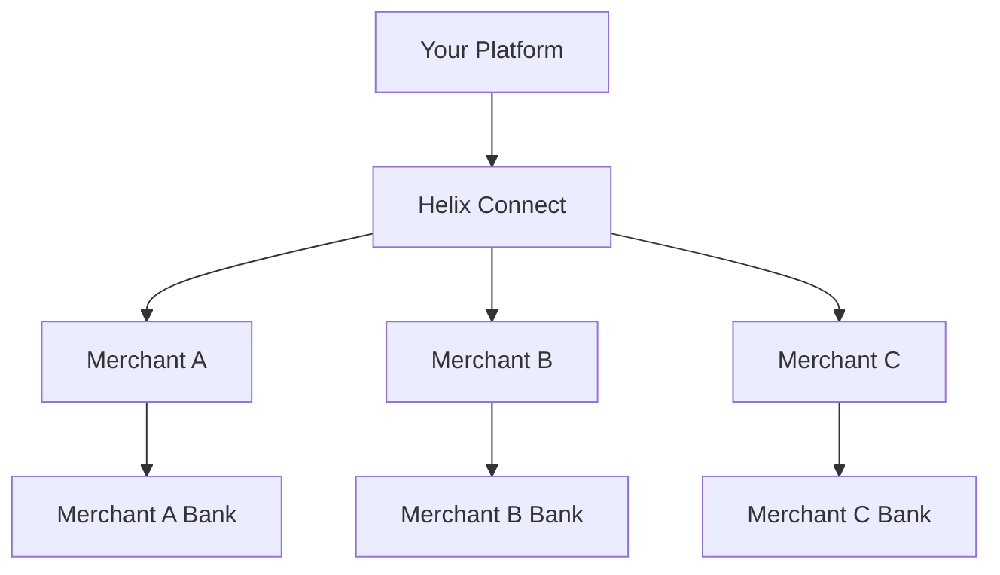

# Connect

Build a marketplace or platform that onboards merchants, processes payments on their behalf, and distributes funds automatically.

## Architecture

Connect handles the complexity of multi-party payments:

- **Merchant onboarding**  - KYC verification, bank account setup, and compliance
- **Split payments**  - Route funds between your platform and merchants
- **Payouts**  - Automatic settlement to merchant bank accounts
- **Reporting**  - Per-merchant transaction history and analytics

## Use cases

| Scenario | Example |
|---|---|
| **Marketplace** | Customers pay merchants through your platform; you take a commission |
| **SaaS with billing** | Your customers collect payments from their end-users |
| **On-demand services** | Route payments between riders, drivers, and your platform |

## Guides

- [**Merchant Onboarding**](./onboarding)  - Verify and activate merchant accounts
- [**Payouts**](./payouts)  - Configure automatic fund distribution
