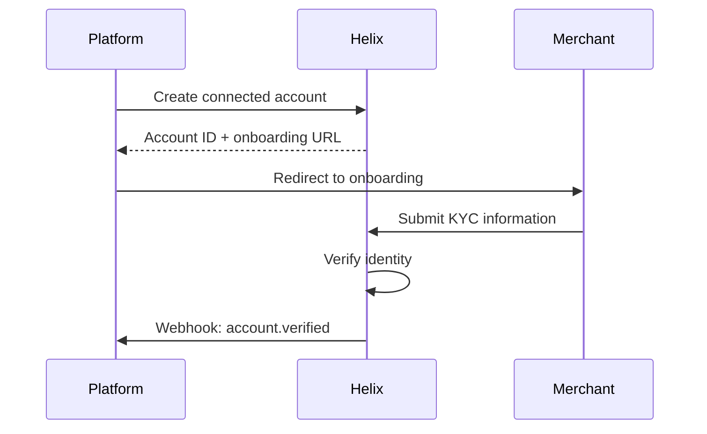

# Merchant onboarding

Before a merchant can receive payments through your platform, they need to complete Helix's KYC (Know Your Customer) verification. Connect provides a hosted onboarding flow that handles identity verification, document collection, and bank account setup.

## Onboarding flow



## Step 1: Create a connected account

import Tabs from '@theme/Tabs';
import TabItem from '@theme/TabItem';

<Tabs groupId="language">
<TabItem value="node" label="Node.js">

```javascript
const account = await helix.accounts.create({
  type: 'standard',
  country: 'US',
  email: 'merchant@example.com',
  business_profile: {
    name: 'Coffee Corner',
    url: 'https://coffeecorner.com',
  },
});

console.log(account.id); // acct_1x2y3z
```

</TabItem>
<TabItem value="python" label="Python">

```python
account = helix.Account.create(
    type="standard",
    country="US",
    email="merchant@example.com",
    business_profile={
        "name": "Coffee Corner",
        "url": "https://coffeecorner.com",
    },
)

print(account.id)  # acct_1x2y3z
```

</TabItem>
</Tabs>

## Step 2: Generate the onboarding link

```javascript
const link = await helix.accountLinks.create({
  account: account.id,
  type: 'account_onboarding',
  return_url: 'https://yourplatform.com/onboarding/complete',
  refresh_url: 'https://yourplatform.com/onboarding/refresh',
});

// Redirect the merchant to link.url
```

The merchant completes the hosted onboarding form. No sensitive data touches your servers.

## Step 3: Listen for verification

Once the merchant passes KYC, you'll receive an `account.verified` webhook:

```json
{
  "type": "account.verified",
  "data": {
    "id": "acct_1x2y3z",
    "payouts_enabled": true,
    "charges_enabled": true
  }
}
```

The merchant can now receive payments and payouts through your platform.

## Account statuses

| Status | Meaning | Action |
|---|---|---|
| `pending` | Onboarding not yet started | Send the onboarding link |
| `in_review` | KYC documents submitted, under review | Wait for Helix verification |
| `verified` | Fully verified, can transact | No action needed |
| `restricted` | Additional documents required | Generate a new onboarding link |

:::note Verification timing
Most merchants are verified within minutes. Complex cases (e.g., businesses in regulated industries) may take up to 2 business days.
:::
