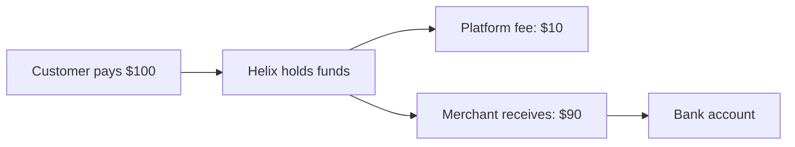

# Payouts

Helix Connect automatically transfers funds from payments to your merchants' bank accounts on a configurable schedule.

## How payouts work

When a customer pays through your platform:

1. Helix collects the full payment amount
2. Your platform fee is deducted
3. The remaining funds are added to the merchant's Helix balance
4. Helix transfers the balance to the merchant's bank account on the payout schedule



## Creating a payment with platform fee

import Tabs from '@theme/Tabs';
import TabItem from '@theme/TabItem';

<Tabs groupId="language">
<TabItem value="node" label="Node.js">

```javascript
const payment = await helix.payments.create({
  amount: 10000,
  currency: 'usd',
  payment_method: paymentMethodId,
  confirm: true,
  on_behalf_of: 'acct_merchant_123',
  application_fee_amount: 1000, // Your platform takes $10.00
});
```

</TabItem>
<TabItem value="python" label="Python">

```python
payment = helix.Payment.create(
    amount=10000,
    currency="usd",
    payment_method=payment_method_id,
    confirm=True,
    on_behalf_of="acct_merchant_123",
    application_fee_amount=1000,
)
```

</TabItem>
</Tabs>

## Payout schedules

Configure how frequently merchants receive payouts:

| Schedule | Description |
|---|---|
| `daily` | Funds are paid out every business day (default) |
| `weekly` | Funds accumulate and pay out once per week |
| `monthly` | Funds accumulate and pay out once per month |
| `manual` | You trigger payouts via the API |

```javascript
await helix.accounts.update('acct_merchant_123', {
  settings: {
    payouts: {
      schedule: { interval: 'weekly', weekly_anchor: 'monday' },
    },
  },
});
```

## Payout statuses

| Status | Description |
|---|---|
| `pending` | Payout is queued |
| `in_transit` | Funds are being transferred to the bank |
| `paid` | Funds have arrived in the merchant's bank account |
| `failed` | The transfer failed (e.g., invalid bank details) |

Listen for the `payout.paid` and `payout.failed` webhooks to track settlement.
