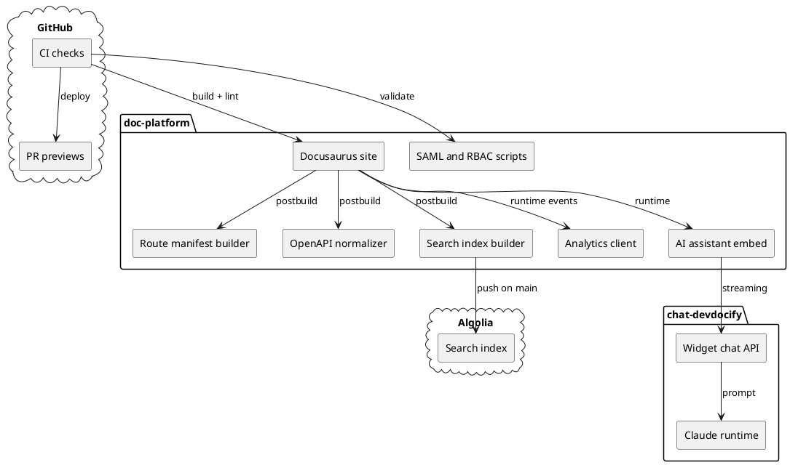

# Explanation

Use explanation pages when you want context on platform design choices and trade-offs.

  
Rationale

  

    These decisions prioritize clarity for readers and maintainable delivery workflows for the
    team.
  

## Why root and docs are split

- `devdocify.com` serves marketing intent and product positioning.
- `devdocify.com/docs` serves technical guidance and implementation detail.
- Keeping these surfaces distinct avoids mixing conversion copy with technical reference content.

## Why this site includes TfL and Petstore

- They demonstrate multi-docset navigation and authoring patterns.
- They provide realistic API playground examples without requiring private backend systems.
- They let the first-party docs explain platform behavior using live, inspectable examples.

## Why docs-as-code is central

- Versioned docs changes can be reviewed in pull requests.
- Build, content, assistant, Lighthouse, and playground health checks run before merge.
- Preview workflows make UI/content regressions visible before production.

## Why search is generated during builds

- The search index includes documentation pages and API operations.
- The generated index gives Algolia stable facets for `docset`, `version`, and `type`.
- CI can skip the push safely when production Algolia credentials are unavailable.

## Why enterprise controls are separate from the static build

- SAML enforcement happens at the proxy or platform layer, not inside generated HTML.
- RBAC publish checks run in CI where the GitHub actor and repository policy are available.
- Analytics events use a typed client so frontend code can emit structured payloads without importing Node-only validators.

## Why diagrams are text-first

- Mermaid and PlantUML source can be reviewed in pull requests.
- PlantUML blocks render without adding a Java dependency to CI.
- Architecture diagrams stay close to the docs that explain the system behavior.

## Platform component overview

