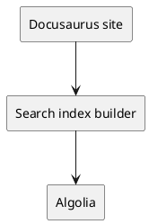

# Add PlantUML diagrams

Use PlantUML when you need sequence, component, or deployment diagrams that are easier to maintain as text than as static images.

## Prerequisites

- Your docs page uses Markdown or MDX.
- The page is in a docset that uses the `remarkPlantuml` plugin.
- Readers can load images from the configured PlantUML rendering endpoint.

## 1. Add a fenced block

Add a fenced code block with `plantuml` as the language:

````md

````

The text after `plantuml` becomes the image alt text. Use short, descriptive text that explains the diagram purpose.

## 2. Keep diagrams close to the explanation

Place the diagram near the section that explains it. Follow the diagram with the main takeaway in prose so readers do not need to interpret the image alone.

## 3. Verify rendering

Build the site:

```bash
npm run build
```

Open the generated page or run the dev server:

```bash
npm start
```

Confirm that the diagram loads as an SVG image and that the alt text describes the diagram.

## Rendering behavior

DevDocify converts `plantuml` fences into image links during Markdown processing. The plugin encodes the diagram source and points the image to the configured PlantUML SVG endpoint.

By default, rendering uses `https://www.plantuml.com/plantuml/svg`. If you need self-hosted rendering, update `PLANTUML_BASE_URL` in `src/remark/remark-plantuml.ts` and rebuild.

## Troubleshooting

- Diagram does not appear: confirm the page uses a docset configured with `remarkPlantuml`.
- Image request fails: confirm the rendering endpoint is reachable from the browser.
- Alt text is too generic: add concise text after `plantuml` in the opening fence.
