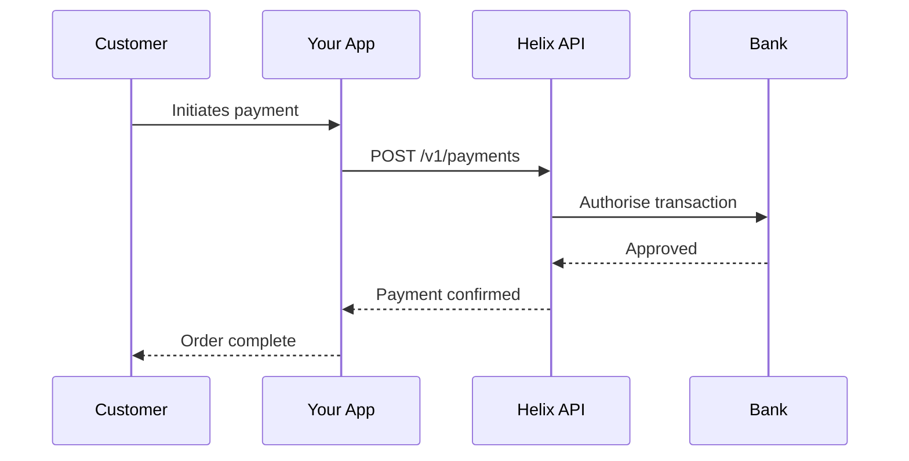

# Getting Started with Helix

Helix provides APIs and SDKs to accept payments, manage payouts, and onboard merchants  - all through a single integration.

## Choose your path

<div className="grid-cards">

| Path | Description | Time |
|---|---|---|
| [**Quickstart**](./quickstart) | Process your first test payment in under 5 minutes | ~5 min |
| [**Accept a Payment**](/payments/accept-a-payment) | Build a complete checkout flow with error handling | ~30 min |
| [**Connect merchants**](/connect/onboarding) | Set up multi-party payments with merchant onboarding | ~1 hour |

</div>

## How Helix works



## Base URL

All API requests are made to:

```
https://api.helix.dev/v1
```

The API accepts JSON request bodies and returns JSON responses. All requests must be authenticated with your API key.

## SDKs

Official SDKs are available for all major languages:

| Language | Package | Install |
|---|---|---|
| Node.js | `@helix/node` | `npm install @helix/node` |
| Python | `helix-python` | `pip install helix-python` |
| Go | `helix-go` | `go get github.com/helix/helix-go` |
| Java | `helix-java` | Maven / Gradle |
| Ruby | `helix-ruby` | `gem install helix-ruby` |
| PHP | `helix/helix-php` | `composer require helix/helix-php` |
