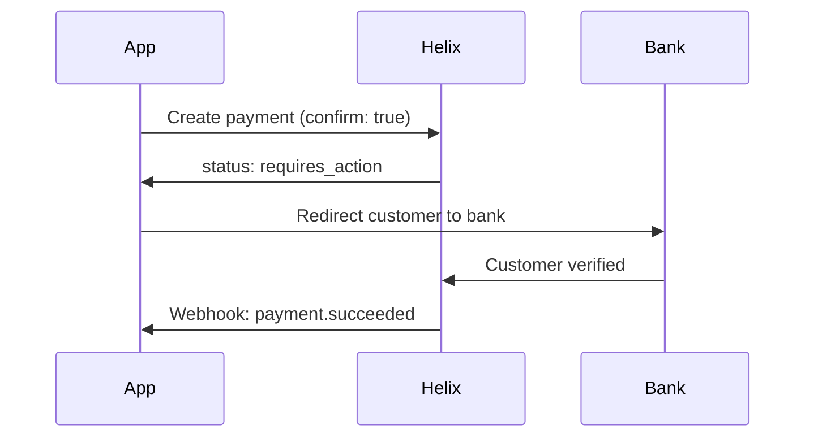

# Accept a Payment

Build a server-side integration that creates and confirms a payment. This guide covers the full flow including parameter validation, 3D Secure handling, and error recovery.

## Before you begin

Make sure you have:
- An [API key](/getting-started/authentication) (test mode is fine)
- The Node.js, Python, or Go [SDK installed](/getting-started/quickstart#1-install-the-sdk)

## Step 1: Create a payment

import Tabs from '@theme/Tabs';
import TabItem from '@theme/TabItem';

<Tabs groupId="language">
<TabItem value="node" label="Node.js">

```javascript
const payment = await helix.payments.create({
  amount: 5000,           // Amount in smallest currency unit (e.g. cents)
  currency: 'usd',
  payment_method: paymentMethodId,
  description: 'Premium plan  - annual',
  metadata: {
    order_id: 'ord_789',
    customer_email: 'jane@example.com',
  },
  confirm: true,
  return_url: 'https://yourapp.com/payment/complete',
});
```

</TabItem>
<TabItem value="python" label="Python">

```python
payment = helix.Payment.create(
    amount=5000,
    currency="usd",
    payment_method=payment_method_id,
    description="Premium plan  - annual",
    metadata={
        "order_id": "ord_789",
        "customer_email": "jane@example.com",
    },
    confirm=True,
    return_url="https://yourapp.com/payment/complete",
)
```

</TabItem>
</Tabs>

### Key parameters

| Parameter | Type | Required | Description |
|---|---|---|---|
| `amount` | integer | Yes | Amount in the smallest currency unit (cents for USD) |
| `currency` | string | Yes | Three-letter [ISO 4217](https://en.wikipedia.org/wiki/ISO_4217) currency code |
| `payment_method` | string | Yes | ID of the payment method to charge |
| `confirm` | boolean | No | Set `true` to immediately attempt the charge |
| `metadata` | object | No | Arbitrary key-value pairs for your own records |
| `return_url` | string | Conditional | Required if the payment may trigger 3D Secure |

## Step 2: Handle the response

After creating a payment, check the `status` field:

```javascript
switch (payment.status) {
  case 'succeeded':
    // Payment complete  - fulfil the order
    break;

  case 'requires_action':
    // 3D Secure required  - redirect the customer
    redirect(payment.next_action.redirect_url);
    break;

  case 'failed':
    // Card was declined  - show an error
    showError(payment.last_error.message);
    break;
}
```

## Step 3: Handle 3D Secure

If the payment status is `requires_action`, the customer's bank requires additional verification:



After the customer completes verification, they are redirected to your `return_url`. The payment status updates to `succeeded` or `failed`.

:::tip Always listen for webhooks
Don't rely solely on the redirect. Network issues can prevent the customer from returning to your site. Use [webhooks](/payments/webhooks) as the source of truth for payment status.
:::

## Full example

<Tabs groupId="language">
<TabItem value="node" label="Node.js">

```javascript
import Helix from '@helix/node';
import express from 'express';

const helix = new Helix(process.env.HELIX_SECRET_KEY);
const app = express();

app.post('/api/pay', async (req, res) => {
  try {
    const payment = await helix.payments.create({
      amount: req.body.amount,
      currency: 'usd',
      payment_method: req.body.payment_method_id,
      confirm: true,
      return_url: `${req.headers.origin}/payment/complete`,
    });

    if (payment.status === 'requires_action') {
      return res.json({
        requires_action: true,
        redirect_url: payment.next_action.redirect_url,
      });
    }

    res.json({ success: true, payment_id: payment.id });
  } catch (err) {
    res.status(400).json({ error: err.message });
  }
});
```

</TabItem>
</Tabs>
