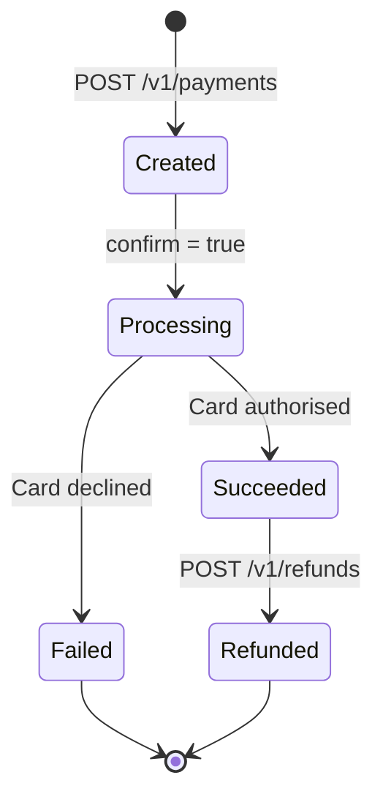

# Payments

Accept one-time and recurring payments from customers worldwide. Helix handles card processing, fraud detection, and compliance so you can focus on your product.

## How payments work

## Supported payment methods

| Method | Regions | Settlement |
|---|---|---|
| Visa / Mastercard | Global | T+2 business days |
| American Express | US, EU, UK | T+2 business days |
| SEPA Direct Debit | EU | T+5 business days |
| Bank transfer | US, EU, UK | T+3 business days |

## Guides

- [**Accept a payment**](/payments/accept-a-payment)  - Process a card payment from start to finish
- [**Refunds**](/payments/refunds)  - Issue full or partial refunds
- [**Webhooks**](/payments/webhooks)  - Get notified about payment events in real time
