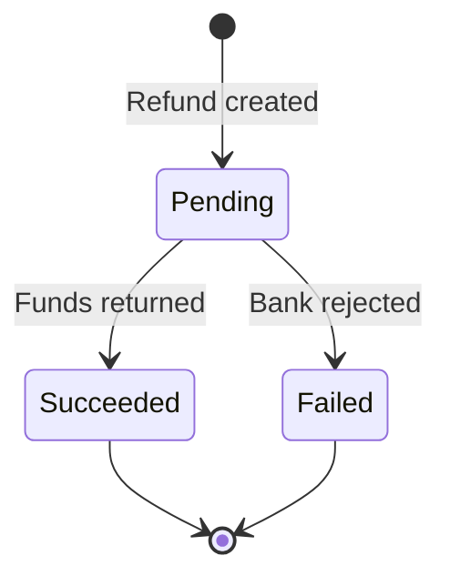

# Refunds

Issue full or partial refunds on successful payments. Refunds are processed back to the original payment method within 5-10 business days.

## Create a refund

import Tabs from '@theme/Tabs';
import TabItem from '@theme/TabItem';

<Tabs groupId="language">
<TabItem value="node" label="Node.js">

```javascript
// Full refund
const refund = await helix.refunds.create({
  payment: 'pay_1a2b3c4d',
});

// Partial refund
const partialRefund = await helix.refunds.create({
  payment: 'pay_1a2b3c4d',
  amount: 1000, // Refund $10.00 of the original amount
});
```

</TabItem>
<TabItem value="python" label="Python">

```python
# Full refund
refund = helix.Refund.create(payment="pay_1a2b3c4d")

# Partial refund
partial_refund = helix.Refund.create(
    payment="pay_1a2b3c4d",
    amount=1000,
)
```

</TabItem>
</Tabs>

## Refund lifecycle



| Status | Description |
|---|---|
| `pending` | Refund submitted to the payment network |
| `succeeded` | Funds have been returned |
| `failed` | The bank rejected the refund (rare) |

## Limits

- You can refund a payment up to **90 days** after the original charge
- Multiple partial refunds are allowed, up to the original payment amount
- Helix fees are **not** returned on refunds

:::note Refund timing
Card refunds typically appear on the customer's statement within 5-10 business days, depending on the issuing bank.
:::
