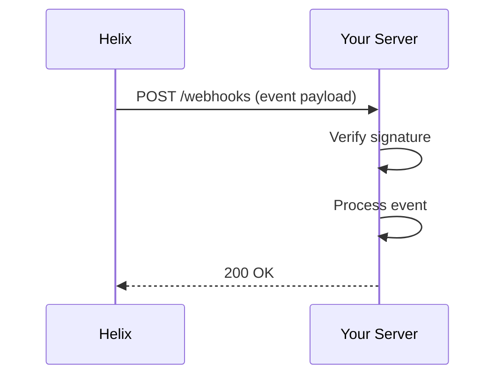

# Webhooks

Webhooks notify your application in real time when events happen in your Helix account  - a payment succeeds, a refund is issued, or a payout completes.

## How it works



## Setting up a webhook endpoint

1. Go to **Dashboard → Developers → Webhooks**
2. Click **Add endpoint**
3. Enter your endpoint URL (e.g., `https://yourapp.com/webhooks/helix`)
4. Select which events to listen for
5. Copy the **signing secret**  - you'll need this to verify payloads

## Verifying signatures

Every webhook request includes an `Helix-Signature` header. Always verify this before processing the event.

import Tabs from '@theme/Tabs';
import TabItem from '@theme/TabItem';

<Tabs groupId="language">
<TabItem value="node" label="Node.js">

```javascript
import Helix from '@helix/node';
import express from 'express';

const app = express();

app.post('/webhooks/helix', express.raw({ type: 'application/json' }), (req, res) => {
  const sig = req.headers['helix-signature'];

  let event;
  try {
    event = Helix.webhooks.constructEvent(
      req.body,
      sig,
      process.env.WEBHOOK_SIGNING_SECRET
    );
  } catch (err) {
    console.error(`Signature verification failed: ${err.message}`);
    return res.status(400).send();
  }

  switch (event.type) {
    case 'payment.succeeded':
      handlePaymentSucceeded(event.data);
      break;
    case 'payment.failed':
      handlePaymentFailed(event.data);
      break;
    case 'refund.created':
      handleRefundCreated(event.data);
      break;
  }

  res.json({ received: true });
});
```

</TabItem>
<TabItem value="python" label="Python">

```python
import helix
from flask import Flask, request, jsonify

app = Flask(__name__)

@app.route("/webhooks/helix", methods=["POST"])
def webhook():
    sig = request.headers.get("Helix-Signature")

    try:
        event = helix.Webhook.construct_event(
            request.data, sig, WEBHOOK_SIGNING_SECRET
        )
    except helix.SignatureVerificationError:
        return "Invalid signature", 400

    if event["type"] == "payment.succeeded":
        handle_payment_succeeded(event["data"])
    elif event["type"] == "payment.failed":
        handle_payment_failed(event["data"])
    elif event["type"] == "refund.created":
        handle_refund_created(event["data"])

    return jsonify(received=True)
```

</TabItem>
</Tabs>

## Event types

| Event | Fires when |
|---|---|
| `payment.created` | A new payment is created |
| `payment.succeeded` | A payment is successfully processed |
| `payment.failed` | A payment attempt fails |
| `refund.created` | A refund is initiated |
| `refund.succeeded` | A refund is completed |
| `payout.paid` | Funds are deposited to a connected account |

## Retry policy

If your endpoint returns a non-`2xx` response, Helix retries the delivery with exponential backoff:

| Attempt | Delay |
|---|---|
| 1st retry | 5 minutes |
| 2nd retry | 30 minutes |
| 3rd retry | 2 hours |
| 4th retry | 8 hours |
| 5th retry | 24 hours |

After 5 failed attempts, the event is marked as failed and visible in the Dashboard.

:::tip Local development
Use the [Helix CLI](https://github.com/helix/cli) to forward webhooks to your local machine:

```bash
helix listen --forward-to localhost:3000/webhooks/helix
```
:::
