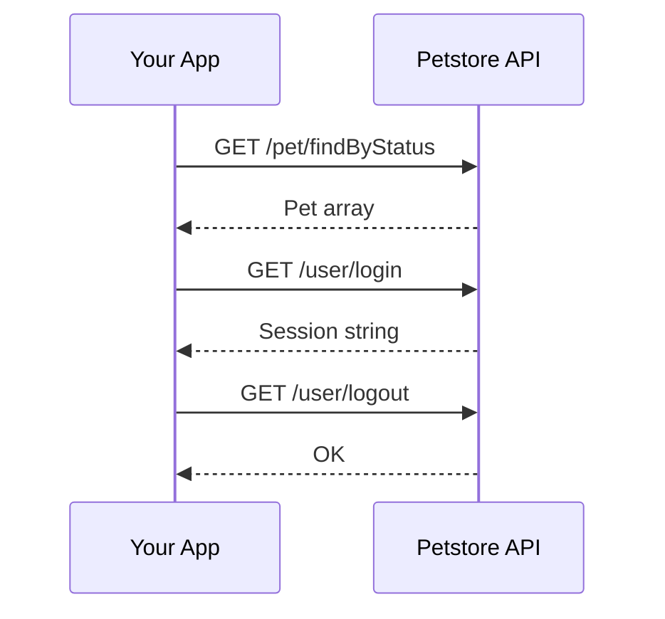

# Overview

Petstore is a sample API that helps you test common API workflows, including finding pets, managing user sessions, and placing orders.

## Choose your path

<div className="grid-cards">

| Path | Description | Time |
|---|---|---|
| [**Quickstart**](/petstore/getting-started/quickstart) | Run the three playground **GET** calls | ~5 min |
| [**Find pets by status**](/petstore/pets/find-pets) | Reference for `GET /pet/findByStatus` | ~10 min |
| [**Login and logout**](/petstore/users/login) | Reference for `GET /user/login` and `GET /user/logout` | ~10 min |

</div>

## How the API works



## Base URL

All API requests are made to:

```
https://petstore3.swagger.io/api/v3
```

The API accepts JSON and XML request bodies and returns JSON or XML responses. Some endpoints can require authentication, depending on your environment.

## API playground

Use the [API playground](/petstore/api-playground) to run three curated demo endpoints in the browser:

- `GET /pet/findByStatus`
- `GET /user/login`
- `GET /user/logout`

These playground examples are configured with sample values and don't require authentication.

## Downloadable OpenAPI (playground only)

The canonical machine-readable description for those three **GET** operations is **[petstore-playground.json](/openapi/petstore-playground.json)**. It doesn't describe POST, PUT, DELETE, or other paths on the public sample server.
