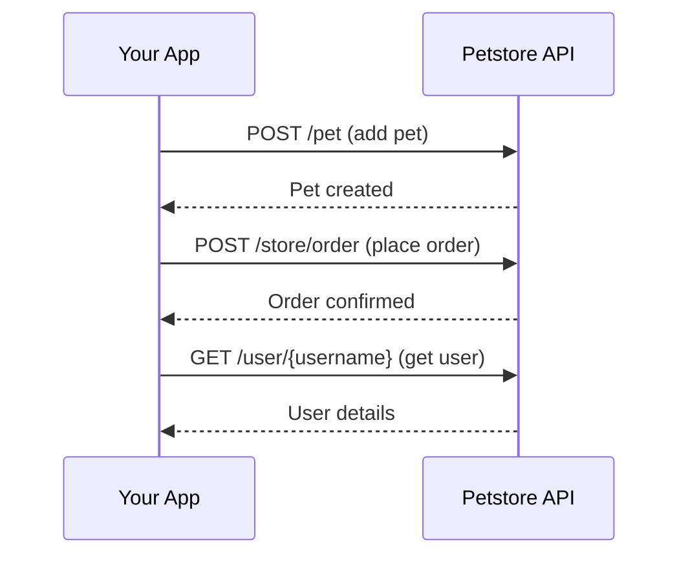

# Overview

The Swagger Petstore API lets you manage pets, place orders, and work with user accounts. It is a sample API for learning and testing.

## Choose your path

<div className="grid-cards">

| Path | Description | Time |
|---|---|---|
| [**Quickstart**](/petstore/getting-started/quickstart) | Add your first pet in under 5 minutes | ~5 min |
| [**Add a pet**](/petstore/pets/add-pet) | Create a pet with name, photo URLs, and status | ~15 min |
| [**Place an order**](/petstore/store/place-order) | Order a pet from the store | ~15 min |

</div>

## How the API works



## Base URL

All API requests are made to:

```
https://petstore3.swagger.io/api/v3
```

The API accepts JSON and XML request bodies and returns JSON or XML responses. Some endpoints require authentication via OAuth2 or an API key.

## API reference

Use the [API reference](/petstore/api-reference) to explore all endpoints, try requests in the browser, and view request and response schemas.
