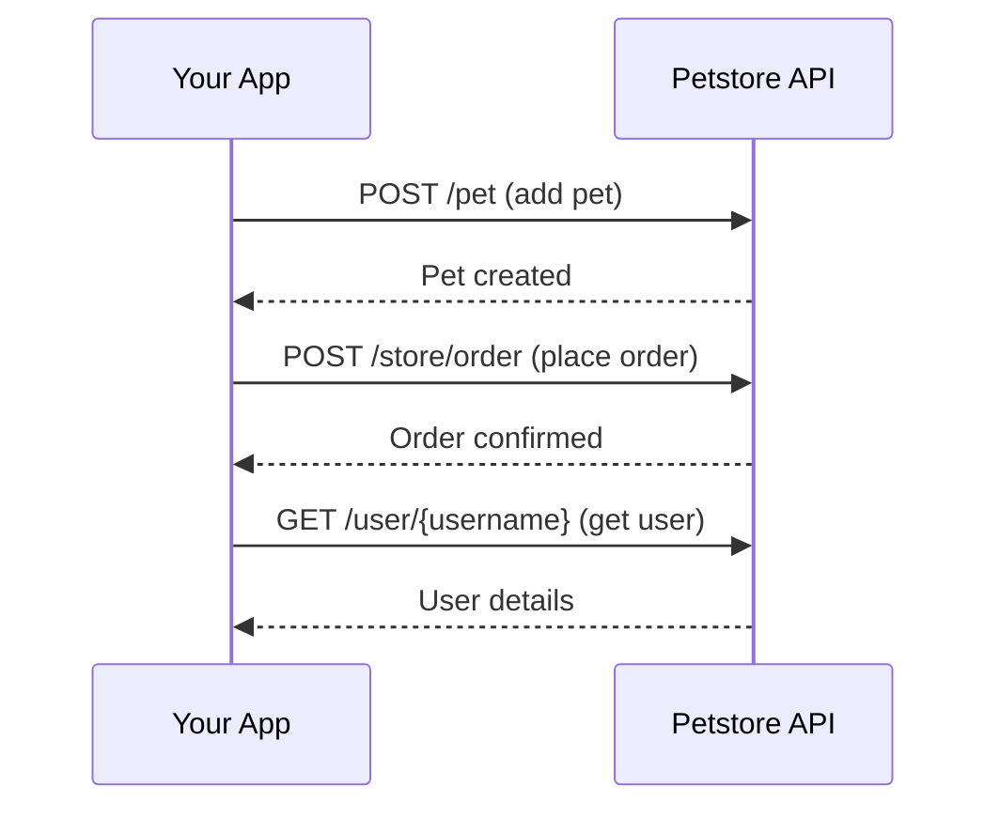

# Overview

Petstore is a sample API that helps you test common API workflows, including finding pets, managing user sessions, and placing orders.

## Choose your path

<div className="grid-cards">

| Path | Description | Time |
|---|---|---|
| [**Quickstart**](/petstore/getting-started/quickstart) | Add your first pet in under 5 minutes | ~5 min |
| [**Add a pet**](/petstore/pets/add-pet) | Create a pet with name, photo URLs, and status | ~15 min |
| [**Place an order**](/petstore/store/place-order) | Order a pet from the store | ~15 min |

</div>

## How the API works



## Base URL

All API requests are made to:

```
https://petstore3.swagger.io/api/v3
```

The API accepts JSON and XML request bodies and returns JSON or XML responses. Some endpoints can require authentication, depending on your environment.

## API playground

Use the [API playground](/petstore/api-playground) to run three curated demo endpoints in the browser:

- `GET /pet/findByStatus`
- `GET /user/login`
- `GET /user/logout`

These playground examples are configured with sample values and don't require authentication.
