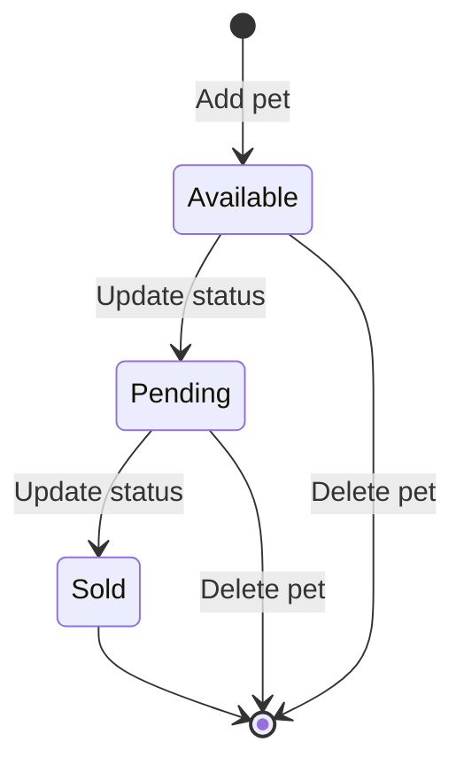

# Pets

Manage pets in the store. Add, find, update, and delete pets. Upload photos for each pet.

## Pet lifecycle

## Pet status values

| Status | Description |
|---|---|
| `available` | Pet is in stock |
| `pending` | Pet is reserved |
| `sold` | Pet has been sold |

## Pet object

| Field | Type | Required | Description |
|---|---|---|---|
| `id` | integer | No | Auto-generated when creating |
| `name` | string | Yes | Pet name |
| `category` | object | No | Category with `id` and `name` |
| `photoUrls` | array | Yes | URLs of pet photos |
| `tags` | array | No | Tags with `id` and `name` |
| `status` | string | No | `available`, `pending`, or `sold` |

## Guides

- [**Add a pet**](/petstore/pets/add-pet) - Create a new pet in the store
- [**Find pets by status**](/petstore/pets/find-pets) - `GET /pet/findByStatus` (playground)
- [**Update a pet**](/petstore/pets/update-pet) - Update pet details
- [**Delete a pet**](/petstore/pets/delete-pet) - Remove a pet from the store
- [**Upload an image**](/petstore/pets/upload-image) - Add a photo to a pet
