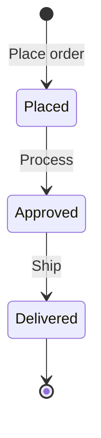

# Store

Place and manage orders for pets. The store tracks inventory by pet status.

## Order lifecycle

## Order status values

| Status | Description |
|---|---|
| `placed` | Order received |
| `approved` | Order approved |
| `delivered` | Order shipped and delivered |

## Guides

- [**Place an order**](/petstore/store/place-order): Create a new order
- [**Get order by ID**](/petstore/store/get-order): Retrieve order details
- [**Cancel an order**](/petstore/store/cancel-order): Delete an order
- [**Inventory**](/petstore/store/inventory): View pet inventory by status
