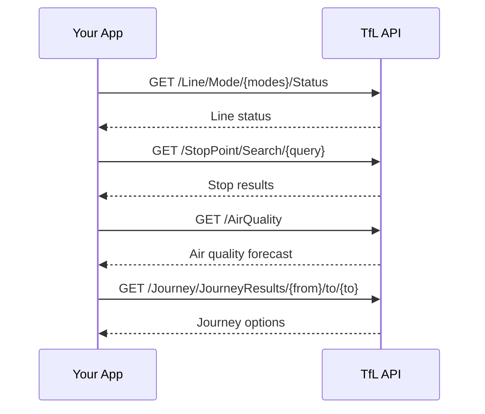

# Overview

The Transport for London (TfL) Unified API provides real-time transport data, including line status, stop search, cycle hire locations, air quality, and journey planning.

## Choose your path

<div className="grid-cards">

| Path | Description | Time |
|---|---|---|
| [**Quickstart**](/tfl/getting-started/quickstart) | Run all playground operations | ~10 min |
| [**Line status by mode**](/tfl/lines/status) | `GET /Line/Mode/{modes}/Status` | ~10 min |
| [**Search stops**](/tfl/stoppoints/search) | `GET /StopPoint/Search/{query}` | ~10 min |
| [**Bike points**](/tfl/getting-started/bike-point) | `GET /BikePoint` | ~5 min |
| [**Air quality**](/tfl/getting-started/air-quality) | `GET /AirQuality` | ~5 min |
| [**Plan a journey**](/tfl/journey/plan) | `GET /Journey/JourneyResults/{from}/to/{to}` | ~10 min |

</div>

## How the API works



## Base URL

All API requests are made to:

```
https://api.tfl.gov.uk
```

For this demo site, playground examples use public endpoints that don't require credentials.

## API playground

Use the [API playground](/tfl/api-playground) to run curated demo endpoints in the browser:

- `GET /Line/Mode/{modes}/Status`
- `GET /StopPoint/Search/{query}`
- `GET /BikePoint`
- `GET /AirQuality`
- `GET /Journey/JourneyResults/{from}/to/{to}`

These playground examples are configured with sample values and don't require authentication.

## Downloadable OpenAPI (playground only)

The canonical machine-readable description for the playground operations is **[tfl-playground.json](/openapi/tfl-playground.json)**. It doesn't describe arrivals, disruptions, or other TfL paths outside the demo scope.
