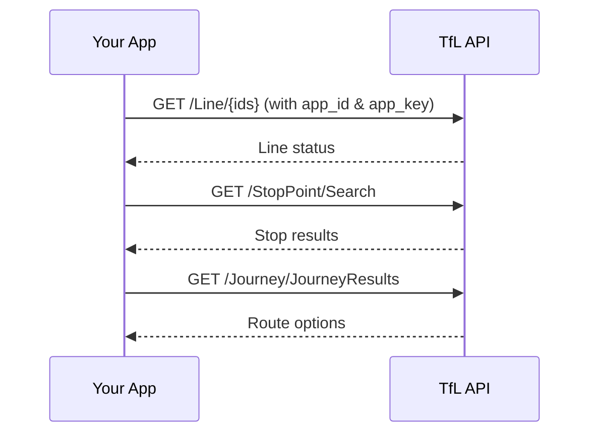

# Overview

The Transport for London (TfL) Unified API provides real-time data for London's transport network: Tube, bus, cycle hire, roads, and more.

## Choose your path

<div className="grid-cards">

| Path | Description | Time |
|---|---|---|
| [**Quickstart**](/tfl/getting-started/quickstart) | Get your first API response in under 5 minutes | ~5 min |
| [**Lines**](/tfl/lines) | Explore Tube and rail line data | ~15 min |
| [**StopPoints**](/tfl/stoppoints) | Find stops and stations | ~15 min |
| [**Journey**](/tfl/journey) | Plan routes between locations | ~20 min |

</div>

## How the API works



## Base URL

All API requests are made to:

```
https://api.tfl.gov.uk
```

You must register for an Application ID and Key and append them as query parameters: `app_id` and `app_key`.

## API reference

Use the [API reference](/tfl/api-reference) to explore all endpoints, try requests in the browser, and view response schemas.
